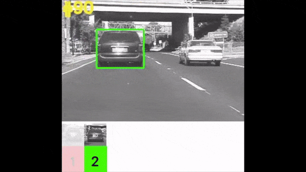

# A Simple Adaptive Tracker with Reminiscences

<center></center>

This is the implementation of the Multi Template Correlation Filter (MTCF) tracker. This tracker provides a simple ensemble based method that explicitly models the different object appearance variations throughout a video's history. Details of the algorithm can be found in our ICRA 2019 paper:

Christopher Xie, Zaid Harchaoui, Emily Fox<br/>
A Simple Adaptive Tracker with Reminiscences<br/>
In Proceedings of IEEE International Conference on Robotics and Automation - ICRA, 2019

## Dependencies

1. Python 2.7
2. [TensorFlow](https://www.tensorflow.org/) (we tested on 1.3.0 and 1.10.0. This will depend on your versions of CUDA and cuDNN)
3. [Keras](https://keras.io/) (we tested on 2.1.4 and 2.2.4)
4. [cyvlfeat](https://github.com/menpo/cyvlfeat)
5. [NumPy](http://www.numpy.org/) / [SciPy](https://www.scipy.org/)
6. [scikit-learn](https://scikit-learn.org/stable/) / [scikit-image](http://scikit-image.org/docs/dev/api/skimage.html)
7. [matplotlib](https://matplotlib.org/) (for plotting purposes)

## Setup

We highly recommend setting up a virtual environment using [Anaconda](https://www.anaconda.com/distribution/) and [pip](https://pypi.org/project/pip/). Here is an example setup using these tools:

```bash
git clone https://github.com/chrisdxie/reminiscent_tracker.git
conda create --name tracking_env
source activate tracking_env
conda install -c menpo cyvlfeat
pip install tensorflow-gpu
pip install keras
pip install -r requirements.txt
```

We highly recommend using [Anaconda](https://www.anaconda.com/distribution/) due to the fact that the [cyvlfeat](https://github.com/menpo/cyvlfeat) library depends on the [VLFeat](http://www.vlfeat.org/) toolbox. Without using [Anaconda](https://www.anaconda.com/distribution/), you will have to manually link/compile the [cyvlfeat](https://github.com/menpo/cyvlfeat) library.

## How to run the tracker

See [MTCF_example.ipynb](MTCF_example.ipynb) for an example of how to use the tracker. This repository provides a few [OTB](http://cvlab.hanyang.ac.kr/tracker_benchmark/index.html)/[VOT](http://www.votchallenge.net/) videos which you can run the tracker on. 

Notes:

* the Jupyter Notebook should be run in the directory in which it lives, otherwise the filepaths must be manually adjusted.
* Upon running the notebook, Keras will automatically download a pre-trained VGG16 model if you haven’t done so before.

## Citation
Our code is released under GPLv3.

If you find our work helpful in your research, please cite our work.

```
@inproceedings{xie2019reminiscences,
  title={A Simple Adaptive Tracker with Reminiscences},
  author={Xie, Christopher and Harchaoui, Zaid and Fox, Emily},
  booktitle={IEEE International Conference on Robotics and Automation},
  year={2019},
  organization={IEEE}
}
```